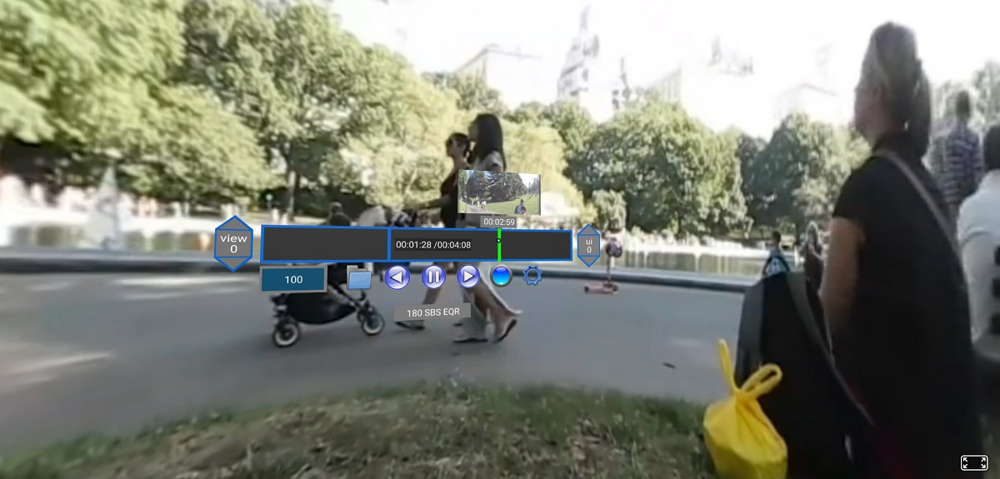
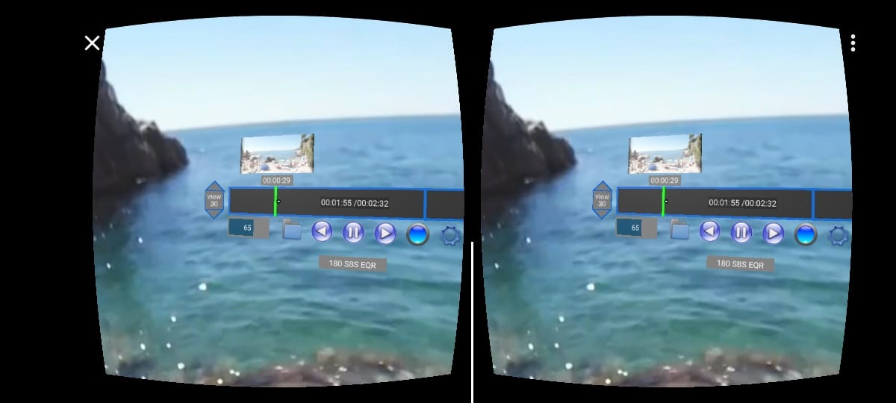
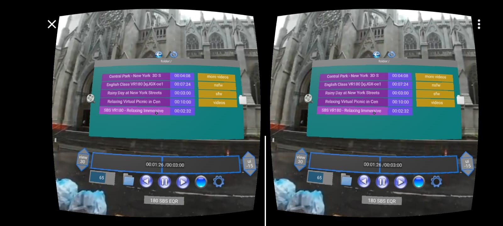

# AFRAME VR PLAYER
VR Video player built using html & js.
- [Screenshots](#screenshots)
- [Usage/Installation](#usageinstallation)
   * [Online](#online)
   * [CLI](#cli)
- [Development](#development)
- [Compatibility](#compatibility)
- [Contributing](#contributing)
- [Acknowledgments](#acknowledgments)

## Screenshots




## Usage/Installation
### Online
Use the [online version](https://mysterion.github.io/aframe-vr-player/) on your web browser. Choose the video with file picker. 

### CLI
1) Download `avrp` from [avrp releases](https://github.com/mysterion/avrp/releases) section
2) Choose the `videos` folder
3) Make sure your device and PC are connected on the same wifi/network
4) go to the URL specified on the cli (192.168.X.X) on web browser of your device(I recommend Chrome on cardboard or firefox reality on oculus quest)
5) Accept SSL certificate and enjoy


## Development
```sh
git clone https://github.com/mysterion/aframe-vr-player.git
cd aframe-vr-player

# go install github.com/mysterion/avrp@latest
# or download the CLI from https://github.com/mysterion/avrp/releases
# 
avrp --dev
```
## Compatibility
VR Player is compatible with a wide range of VR headsets, including:

- Oculus Quest
- Google Cardboard
- HTC Vive
- PlayStation VR
- Samsung Gear VR
- And more!

As this project uses [AFRAME](https://github.com/aframevr/aframe) which uses [WebXR API](https://developer.mozilla.org/en-US/docs/Web/API/WebXR_Device_API)
It should be run on WebXR compatible Web Browsers([More Info.](https://aframe.io/docs/1.5.0/introduction/vr-headsets-and-webxr-browsers.html#which-vr-headsets-does-a-frame-support)) 

## Contributing
We welcome contributions from the community to enhance AFRAME VR Player and make it even better. If you have any suggestions, bug reports, or feature requests, please feel free to open an issue or submit a pull request.
